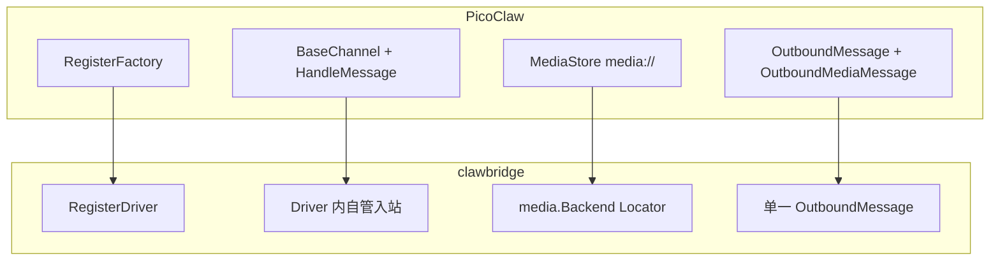

# PicoClaw `pkg/channels` → clawbridge `drivers/` 迁移教程

本文说明如何把 **PicoClaw** 里某个 `pkg/channels/<name>` 通道实现，迁到 **clawbridge** 的 **`drivers/<name>`** 包，并与现有 **`noop`**、**`feishu`** 对齐。迁移前请先通读 [im-bridge-technical-design.md](./im-bridge-technical-design.md) 与 [public-api.md](./public-api.md)。

---

## 1. 模型差异（必读）

| 维度 | PicoClaw `channels` | clawbridge `drivers` |
|------|---------------------|----------------------|
| 注册方式 | `channels.RegisterFactory(name, func(cfg *config.Config, bus) (Channel, error))` | `client.RegisterDriver(name, func(ctx, cfg ClientConfig, deps Deps) (Driver, error))` |
| 核心接口 | `Channel`：含 `Send` 返回 `[]string`、`IsRunning`、`IsAllowed` 等 | `Driver`：仅 `Name`、`Start`、`Stop`、`Send` |
| 配置 | 嵌在全局 `config.Config` 的各通道大块（如 `Channels.Telegram`） | 每条客户端一行 `ClientConfig` + **`options` map** |
| 入站 | `BaseChannel.HandleMessage` → `bus.PublishInbound`（PicoClaw 的 `bus.InboundMessage`） | 自行组 **`github.com/lengzhao/clawbridge/bus.InboundMessage`** → `deps.Bus.PublishInbound` |
| 出站文本 | `Send(ctx, bus.OutboundMessage)`，`Content` + `ChatID` | `Send(ctx, *bus.OutboundMessage)`：`Text` + **`To.SessionID`**，且 **`msg.ClientID`** 由宿主填写 |
| 出站媒体 | 常走 **`OutboundMediaMessage`** + `MediaPart.Ref`（`media://…`）+ **`MediaStore.Resolve`** | **同一 `OutboundMessage`** 里 **`Parts []MediaPart`**，`Path` 为 **Locator**（本地路径 / `s3://` / …），用 **`deps.Media.Open`** 读流上传 |
| 入站媒体 | `MediaStore.Store` 得到 `media://` 引用，填入 `InboundMessage.Media` | **`MediaPaths []string`**，每条为 Locator；下载后 **`deps.Media.Put(ctx, scope, name, r, size, ct)`** |
| 生命周期 | `Manager` 注入 `PlaceholderRecorder`、`MediaStore` 等 | **`client.Manager`** 只注入 **`Deps{Bus, Media}`**；无 Placeholder/Typing 注入 |
| 可选能力 | `TypingCapable`、`MessageEditor`、`ReactionCapable`、`PlaceholderCapable`、… | 最小 **`Driver`** 仍仅 `Send`；**文档约定**可选 **`MessageStatusUpdater`（消息级状态）**、**`MessageEditor`（编辑，`MessageID` 空则最近成功 `Send`）** — 见 [public-api.md](./public-api.md) §3.4；**未在代码中实现时** 以文档为设计目标 |

结论：**不是复制粘贴改 import**，而是把「通道」收窄成 **单一 Driver + 统一 bus 类型 + media.Backend**，并**砍掉或外提** Manager 里那套占位符/打字/反应链路；占位符等多为 **Driver 内部实现**。可选 **状态 / 编辑** 按 public-api **type assert** 扩展。

---

## 2. 推荐迁移顺序

1. **读** 目标通道的 `init.go`、`New*Channel`、`Start`/`Stop`、入站 handler、`Send`/`SendMedia`。
2. **列** 该通道依赖的 PicoClaw 专有类型：`BaseChannel`、`config.XXXConfig`、`channels.Err*`、`logger`、`identity`、`media.MediaStore` 等。
3. **建包** `drivers/<name>/`，参考下列文件布局。
4. **先跑通** `Start` + 一条假入站或真实 webhook/长连接 + `PublishInbound`。
5. **再实现** `Send`（文本 + 如有附件则 `Open` 上传）。
6. **最后** 把 `allow_from` / `group_trigger` 等从原 config 挪到 **`options`**（或后续扩展 `ClientConfig`）。

---

## 3. 目录与注册（与 `noop` / `feishu` 一致）

```
drivers/
  <name>/
    init.go          // package <name>; func init() { client.RegisterDriver("<name>", New) }
    <name>_64.go     // 若依赖仅 64 位 SDK，可用 build tag；否则单文件即可
    <name>_32.go     // 可选：32 位架构上 New 返回明确错误（见 feishu）
    creds.go         // 可选：从 map[string]any 解析 options
    ...              // 平台协议实现
```

在 **`drivers/drivers.go`** 增加空导入：

```go
_ "github.com/lengzhao/clawbridge/drivers/<name>"
```

---

## 4. `New` 函数契约

```go
func New(ctx context.Context, cfg config.ClientConfig, deps client.Deps) (client.Driver, error)
```

- **`cfg.ID`**：实例唯一 id，应写入入站 **`InboundMessage.ClientID`**（与 `OutboundMessage.ClientID` 对应），也用于日志与媒体 **`Put` 的 scope** 分段。
- **`cfg.Options`**：把原 `config.Channels.XXX` 的字段平铺或嵌套进 YAML/JSON 解码后的 map；用辅助函数读 `string` / `bool` / `[]string`（可参考 `drivers/feishu/creds.go`）。
- **`deps.Bus`**：`*bus.MessageBus`，入站 **`PublishInbound`**。
- **`deps.Media`**：`media.Backend`，入站 **`Put`**、出站 **`Open`**。

不要在 Driver 里依赖 **`github.com/sipeed/picoclaw/pkg/bus`** 的消息结构；必须 **`github.com/lengzhao/clawbridge/bus`**。

---

## 5. 入站：`InboundMessage` 字段映射

PicoClaw 入站常见字段 → clawbridge：

| PicoClaw | clawbridge |
|----------|------------|
| `Channel`（PicoClaw 通道名） | 建议填 **`cfg.ID`** → clawbridge **`InboundMessage.ClientID`**（多实例不冲突） |
| `ChatID` | **`InboundMessage.SessionID`**（各 Driver 按需编码；可与原 `ChatID` 同值或组合串） |
| `MessageID` | `MessageID` |
| `Content` | `Content` |
| `Media`（`media://`） | **`MediaPaths`**（Locator 字符串） |
| `Peer` | `Peer`（`Kind` / `ID` 语义保持一致） |
| `Sender` / `SenderID` | **`Sender`**（`SenderInfo`）；clawbridge **无顶层 `SenderID`**，由宿主读 `Sender` |
| `MediaScope` | 不单独字段；scope 作为 **`Media.Put` 的第一个参数** 传入即可 |
| `SessionKey` | 若业务需要，可放入 **`Metadata`** |

**时间戳**：设置 **`ReceivedAt`**（如 `time.Now().Unix()`）。

---

## 6. 出站：`Send` 与校验

`bus.PublishOutbound` 会校验（见 `bus/bus.go`）：

- `ClientID`、`To.SessionID` 非空；
- `Text` 与 `Parts` 至少一个非空；每个 `Part.Path` 非空。

实现 **`Send`** 时：

- 会话路由键使用 **`msg.To.SessionID`**（及按需 **`msg.To.UserID`** / **`msg.To.Kind`**）；Driver 负责解析为平台 API 所需参数。
- 回复线程使用 **`msg.ReplyToID`** / **`msg.ThreadID`**（若平台支持）。
- 媒体：对每个 **`msg.Parts`**，`deps.Media.Open(ctx, part.Path)`，读流上传到 IM；文件名/MIME 可用 **`Filename`** / **`ContentType`** 提示。

---

## 7. 媒体：从 `MediaStore` 迁到 `Backend`

| 操作 | PicoClaw | clawbridge |
|------|----------|------------|
| 入站保存 | 下载 → 写盘 → `Store` → `media://ref` | 下载 → **`Backend.Put(ctx, scope, name, r, size, ct)`** → 返回 **路径等 Locator** → 填入 **`MediaPaths`** |
| 出站读取 | `Resolve(ref)` 得本地路径 | **`Backend.Open(ctx, loc)`** |
| scope | `BuildMediaScope(channel, chatID, msgID)` | 自订字符串即可（如 **`clientID/sessionID/messageID`**），只要 **`RemoveScope`** 时能对应清理 |

若需 **`RemoveScope`**，使用与 **`Put` 相同的 scope 字符串**（本地 Backend 会按 scope 记录文件）。

---

## 8. `BaseChannel` 行为如何落地

原通道若嵌入 **`BaseChannel`**，在 clawbridge 中通常要 **内联或复制** 这部分逻辑（不要依赖 picoclaw 的 `bus`）：

- **`IsAllowedSender` / `ShouldRespondInGroup`**：见 **`drivers/feishu/allowlist.go`**（与 PicoClaw 语义对齐的精简实现）。
- **`HandleMessage` 里的 Typing / Reaction / Placeholder**：**clawbridge Manager 不会调用**；若仍要「思考中」体验，只能在 **宿主** 在消费入站后自行调平台 API，或后续给 clawbridge 增加扩展点。

---

## 9. 错误与重试语义

PicoClaw 使用 **`channels.ErrTemporary`**、**`ErrRateLimit`** 等供 Manager 重试。clawbridge 当前 **`RunOutboundDispatch`** 对 **`Send` 错误仅打日志并继续**，**不会自动重试**。

迁移时建议：

- 仍用 **`fmt.Errorf("...: %w", errTemporary)`** 等形式保留「可重试」语义，便于以后 Manager 扩展；
- 或直接在 **`Send` 内做有限次重试**（与 feishu 发卡片失败回退文本类似）。

---

## 10. 配置示例

根目录 **`config.example.yaml`** 与 **`docs/public-api.md`** 中有 **`feishu`** 的 YAML 样例。新 driver 建议：

- 在 **`config.example.yaml`** 增加一段注释掉的 `clients` 条目；
- 在 **`docs/public-api.md`** 或本文件增加一小节说明 **`options` 键名**。

---

## 11. 自检清单（每个新 driver）

- [ ] `init.go` 中 **`RegisterDriver`** 名称与 YAML **`driver:`** 一致  
- [ ] 仅依赖 **`github.com/lengzhao/clawbridge/...`**（避免 picoclaw `bus` / `channels` 类型混入）  
- [ ] 入站 **`ClientID` == `cfg.ID`**（多实例）  
- [ ] 媒体走 **`deps.Media.Put` / `Open`**，消息里只存 **Locator 字符串**  
- [ ] **`Start`/`Stop`** 释放 goroutine、HTTP server、长连接  
- [ ] **`drivers/drivers.go`** 已空导入新包  
- [ ] **`go build ./...`** 通过  

---

## 12. 参考实现

| 文件 | 作用 |
|------|------|
| `drivers/noop/noop.go` | 最小 **`Driver`** 骨架 |
| `drivers/feishu/init.go` | 注册入口 |
| `drivers/feishu/feishu_64.go` | WebSocket 入站、`Send` 卡片/文本/附件、`fetchBotOpenID` |
| `drivers/feishu/creds.go` | `options` 解析 |
| `drivers/feishu/allowlist.go` | allowlist + 群触发 |

按通道复杂度，**Telegram / Discord / Slack** 等与 **`BaseChannel` + Manager** 绑定较深，迁移工作量主要在 **去掉 PlaceholderRecorder 链路** 与 **合并 `OutboundMediaMessage` 到单一 `OutboundMessage`**；**Webhook 类** 通道通常更接近 **Start 里挂 HTTP + 校验签名** 模式，与 feishu 的长连接不同但 **`Driver` 形状相同**。

---

## 13. 流程图（总览）



若你希望迁移后仍暴露 **会话级打字** 等能力，需在 **Driver 内** 自行实现或另开 issue；**消息级「处理中 / 完成 / 异常」** 见 [public-api.md](./public-api.md) 的 **`MessageStatusUpdater`**。**Placeholder** 建议 **留在 IM Client / `Send` 内部**，不抬到总线。
