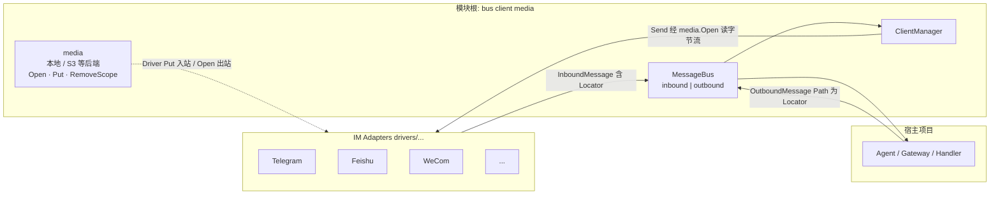
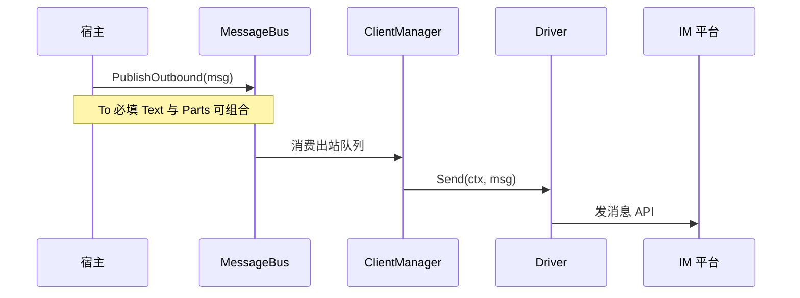

# Clawbridge：多 IM 对接 Claw 的 Go 库 — 技术分析与技术方案

本文档基于对 **PicoClaw**（`sipeed/picoclaw`）channel 体系与 **OpenClaw** 社区「Universal IM / 网关」讨论的分析，给出可独立复用的 Go 库设计方向，供 `clawbridge` 或其它 Claw 系项目集成。

**本文约定（速览）**

| 项 | 约定 |
|----|------|
| 仓库布局 | 模块根下直接使用 `bus/`、`client/`、`media/` 等，**不使用 `pkg/`** |
| 出站模型 | **单通道 + 单一 `OutboundMessage`**，正文与附件同一结构 |
| 寻址 | **必须**带显式 **`To`（Recipient）**；`ReplyToID` / `ThreadID` 仅可选修饰 |
| 媒体 | **默认本地磁盘**；`Inbound` / `Outbound` 里每条媒体一个 **字符串定位符**（见下）；**无** PicoClaw 式 `media://` 需单独 `Resolve` 的句柄层 |
| 定位符语义 | 同一字段（如 `MediaPaths[]` / `MediaPart.Path`）表示 **Media Locator**：**本地绝对/相对路径**（默认、可 **`os.Open`**），或 **`s3://bucket/key`**、**`https://...`（如预签名 URL）** 等；非本地时由 **`media.Open`**（见 §3.4）统一读流，避免集成方散落各云 SDK |

---

## 1. PicoClaw：Channel / Bridge 实现要点

PicoClaw 采用 **Go 单体 + 清晰分层**，与「可复用 IM 桥接库」的目标高度同构，可直接作为参考架构。

| 模块 | 职责 |
|------|------|
| `pkg/bus` | `MessageBus`：`PublishInbound` / `ConsumeInbound`，`PublishOutbound` / `SubscribeOutbound`，以及 **`outboundMedia` 专用通道**，将「各 IM → 业务 / Agent」与「业务 → 各 IM」解耦。 |
| `pkg/bus/types` | 结构化消息：`Peer`、`SenderInfo`、`InboundMessage`（含 `Media []string` 的 `media://` 引用）、`OutboundMessage`、`OutboundMediaMessage` + `MediaPart`。 |
| `pkg/channels` | `BaseChannel` 统一鉴权、群触发、`HandleMessage` 中注入 MediaScope、可选 Typing/Reaction/Placeholder；**工厂注册表** `RegisterFactory`；`Manager` 按配置 `initChannel`。 |
| `pkg/channels/manager` | 每通道独立 **worker + 队列**，限流、重试、`preSend`；**共享 HTTP**，对实现 `WebhookHandler` / `HealthChecker` 的通道挂路由。 |
| `pkg/channels/errors` | `ErrRateLimit`、`ErrTemporary` 等，Manager 用 `errors.Is` 决定退避策略。 |
| `pkg/media` | `MediaStore`：`Store` / `Resolve` / `ReleaseAll(scope)`，引用 `media://…`，按 **scope**（如 `channel:chatID:messageID`）做生命周期与 TTL 清理。 |
| Bridge 形态 | 文档中 **WhatsApp** 有 *Bridge URL* 与 *Native(whatsmeow)* 两种模式；Signal 等存在 **独立 bridge 进程 + Unix Socket** 的思路——即 **重协议 / 重依赖放在进程外，主程序只认稳定 IPC/HTTP**。 |

**结论要点**：统一总线 + 结构化消息 + 可选能力接口 + Manager 编排；PicoClaw 侧媒体常用 **`media://` 引用 + `MediaStore.Resolve`**。

**与本库的差异（有意为之）**：（1）PicoClaw 出站 **分通道**；**clawbridge** 合并为 **单一 `OutboundMessage`**，且 **`To` 显式**，支持主动投递。（2）PicoClaw 媒体多走 **`media://` + MediaStore**；**clawbridge** 消息里 **一条字符串一个媒体**（**默认本地路径**；**可选** `s3://` / `https://`），通过 **`media` 包的 `Open`/`Put` 后端** 统一读写，避免自建第二套引用协议。

---

## 2. OpenClaw：与 Bridge 的关系（概念层）

OpenClaw 本体以 **TypeScript 侧按平台的 Channel Plugin** 为主；社区曾提出 **Universal IM**：IM 侧 **POST webhook 进入网关**，回复再 **POST 到 outbound URL**（JSON 含 `text`、会话、`replyToId` 等）。相关 issue 可能被关闭或未并入主线，但 **「Webhook / 中间网关适配各 IM」** 仍是合理集成形态：

- 本 **Go 库** 可扮演文档中的 **Intermediate Gateway**：对接微信/飞书/企业微信等，将消息 **规范化** 后交给任意 Claw 运行时（PicoClaw 可走 Bus；OpenClaw 可走其网关 HTTP/WebSocket，视具体版本与协议而定）。
- 与 PicoClaw 的差异：OpenClaw 更偏 **插件与 CLI 配置**，没有 PicoClaw 这一套 **Go Bus**；库侧应输出 **稳定领域模型 + 可选 HTTP 适配器**，避免绑死某一种 Claw 发行版。
- **与本库出站模型的关系**：社区示例里「`chatId` + `replyToId`」偏 **会话内回复**；**clawbridge** 将其泛化为 **`To` 必填 + `ReplyToID` 可选**——适配层可把「仅回复」写成「`To` 取自 inbound 的会话 ID + 填 `ReplyToID`」，**主动发消息**则只填 `To`、不写 `ReplyToID`。

---

## 3. 目标库技术方案

### 3.1 总体架构



**出站数据路径（与上图一致）**：宿主构造 **`OutboundMessage`（含 `To`、`Text`、`Parts`）** → `PublishOutbound` → Manager 按 `ClientID` 入队 → 对应 Driver **`Send`**；**不存在**单独的「媒体出站队列」。



- **ClientManager**：读取配置，对每个 `client` 调用对应 **Factory**，`Start` / `Stop`。**本库当前不实现**「多 client **共享**同一 `http.ServeMux` / 单端口集中注册 webhook」；各 Driver 自行起监听或注册路由，或由**宿主进程**在外部合并 HTTP（见 §3.7）。
- **MessageBus**：**inbound** 与 **outbound 各一条通道即可**；出站为 **单一 `OutboundMessage` 类型**，可同时携带 **文本与附件（零或多段媒体）**，由 Manager 与 Driver 一次编排发送，**不**再拆成「纯文本通道 / 纯媒体通道」。
- **media 包**：**默认本地磁盘**（临时根目录 + **按 scope 清理**）。**目标形态**含 S3 兼容存储与 **HTTP 预签名 URL**（见 §3.4）；**当前仓库**仅内置 **本地** `Backend`，对象存储等通过 **`media.Backend` 注入**（与 [public-api.md](./public-api.md) §1.2 `WithMediaBackend` 一致）。对 **Driver** 的接口仍是 **`Put` / `Open` / `RemoveScope`**；消息里 **只存 Locator 字符串**。

### 3.2 配置：多 IM Client

建议使用 **显式实例列表**，避免隐式全局单例：

```yaml
clients:
  - id: feishu-bot-1
    driver: feishu
    enabled: true
    options: {}
  - id: webchat-1
    driver: webchat
    enabled: true
    options:
      listen: "127.0.0.1:8765"
      path: /
```

- **`id`**：贯穿日志、`InboundMessage.Channel`、临时文件 **scope**（用于按会话/消息批量清理），支持多账号并存。
- **`driver`** → 注册表查找构造函数（对齐 PicoClaw `RegisterFactory` 模式）。
- **HTTP 监听**（如 `webchat`、未来 webhook 类 driver）：由 **各 Driver 文档**在 **`options` 内**约定字段（例如 webchat 的 `listen` / `path`）；**clawbridge 不在 Manager 层**把多个 client 挂到**同一个**监听端口的 mux 上。若需单端口多路径，由宿主写自己的 `http.Server`，在路由里分发给各 Driver 提供的 `Handler`（若该 Driver 暴露）或反向代理。

### 3.3 收发：文本与文件

**Inbound 与 Outbound 的分工**

- **Inbound**：描述「谁从哪来」——`Sender`、`Peer`、`ChatID` 等反映 **来源会话**；宿主若要 **仅回复本条**，可从 Inbound 推导默认 `To`，但 **推送到别处** 时仍须显式填 `OutboundMessage.To`。
- **Outbound**：描述「发到哪去」——**不依赖**「必须与上一条 Inbound 同源」；`To` 一律由宿主（或策略层）给出。

**统一领域模型**（可与 PicoClaw 对齐，便于 Adapter 对接或转换）：

- **Inbound**：`Channel`（client id）、`Peer`、`Sender`、`ChatID`、`MessageID`、`Content`、**`MediaPaths []string`**（每个元素为 **Media Locator**：默认由 Driver 经 **`media.Put`** 得到 **本地路径**，或配置对象存储时得到 **`s3://bucket/key`**；空则无异步媒体）、`Metadata`。
- **Outbound（单一结构，不拆通道）**：一条消息可同时包含 **可选正文** 与 **零或多段媒体**；每段 **`MediaPart.Path`** 同为 **Locator**（宿主填 **本地路径** 或 **`s3://...` / 预签名 URL**，与入站约定一致）；可选 `Caption`、`Filename`、`ContentType`。长文 split 仍可作为 **Manager 侧可选策略**。

**出站寻址：显式指定收件方，而非「只能回复当前会话」**：

- **必须**携带 **发送目标**（由宿主填写），例如：
  - `ClientID`：从哪个已配置的 IM 实例发出；
  - **`To`（收件人/会话描述）**：至少包含平台可识别的 **会话维度**（如 `ChatID` / `OpenChatID` / `RoomID`）；若平台支持「发到指定用户」且与会话 ID 不同，则同时填 **`UserID` / `OpenID`** 等（具体字段名由 Driver 文档约定，可收拢在 `Recipient` 结构体中）；
  - **`Peer.Kind`**（如 `direct` / `group` / `channel`）：帮助 Driver 选择 API（群 @、私聊、频道帖文等）。
- **`ReplyToMessageID` / `ThreadID` 等**：**可选**，仅用于 UI 串楼、线程回复；**不能**作为唯一寻址手段——即允许 **主动推送到任意已授权目标**（在策略允许的前提下），与「仅回 inbound 同源」解耦。

**策略与安全（建议由宿主或 Manager 插件实现）**

- 主动投递前做 **allowlist / 角色校验**（例如仅允许向「当前群」「已配对用户」发信），避免 Bot Token 被滥用向任意 ID 发垃圾消息。
- Driver 仅负责 **协议与错误语义**；**是否允许该 `To`** 不属于各 Driver 重复实现逻辑。

示意（字段名可按实现微调）：

```go
type Recipient struct {
    ChatID   string // 会话/群/频道 ID（平台原生）
    UserID   string // 可选：私聊对象或 @ 对象，依平台而定
    Kind     string // direct | group | channel | ""
}

// Path = Media Locator：本地路径 | s3://bucket/key | https://...
type MediaPart struct {
    Path        string
    Caption     string
    Filename    string
    ContentType string
}

type OutboundMessage struct {
    ClientID      string
    To            Recipient // 必填；平台专有 ID 可放 Metadata
    Text          string
    Parts         []MediaPart // 每段 Path 为 Locator
    ReplyToID     string      // 可选
    ThreadID      string      // 可选
    Metadata      map[string]string
}
```

各 **Driver** 建议实现的最小接口集合：

- `Start(ctx) / Stop(ctx)`
- `Send(ctx, msg *OutboundMessage) error` — **统一入口**：对非空 `Parts[i].Path` 使用 **`media.Open(ctx, loc)`**（内部对 `file`/`s3`/`http(s)` 分流）或 **纯本地时直接 `os.Open`** 读流后上传；保证 **Locator 在进程内可读**（凭证由 `media` 后端配置）。
- 入站：向 Bus `PublishInbound` 或等价回调

**可选接口（与 `Send` 分离，见 [public-api.md](./public-api.md) §2.1、§3.4）**：

- **`MessageStatusUpdater`**：`UpdateStatus(ctx, *UpdateStatusRequest) error`。更新 **单条已存在消息** 的 UI 状态（**消息级**，例如「处理中 / 处理完成 / 处理异常」），**不是**会话级打字；请求中 **`MessageID` 必填**。
- **`MessageEditor`**：`EditMessage(ctx, *EditMessageRequest) error`。编辑已发送内容；**不**通过 `OutboundMessage.Metadata` 伪装成发送。若 **`MessageID` 为空**，约定为 **该 `ClientID` + `To` 下最近一次成功 `Send` 的消息**（细则见 public-api §2.2.1）。

占位符、卡片内部多步刷新等仍属 **Driver 实现细节**，不必暴露为上述接口。

**错误分类**：建议沿用 **可重试 / 限流 / 永久失败** 等语义；宿主在 **`OutboundSendNotify`** 内用 **`errors.Is`**（如 **`ErrTemporary`**）+ **`PublishOutbound`** 自建重试（与 PicoClaw Manager 内建重试不同，本库 **单次** `Send`）。

### 3.4 media 包（默认本地，**支持 S3 等对象存储**）

**原则**：消息里 **不出现** PicoClaw 式 `media://` **内部 ID**；每条媒体 **一个 Locator 字符串**。  
- **本地优先**：Locator 为路径时，集成方可继续 **`os.Open` / `os.ReadFile`**，零依赖。  
- **对象存储**：Locator 为 **`s3://bucket/key`**（或实现约定的别名）时，由 **`media.Open`** 读流；入站 **`media.Put`** 可把字节写入桶并 **直接返回 `s3://...`** 填入 `MediaPaths`，无需落盘。

**配置示例**（可与全局 `clients` 并列，具体字段名实现时定稿）：

```yaml
media:
  backend: local          # 默认
  root: /var/tmp/clawbridge
  # 可选改为对象存储（S3 兼容：AWS S3、MinIO、OSS 等）
  # backend: s3
  # bucket: my-app-media
  # prefix: clawbridge/
  # region: us-east-1
  # endpoint: ""            # 留空走默认 AWS；填 MinIO 等自定义 endpoint
  # credentials: env      # 或显式 key/secret，由实现定义
```

**推荐对外接口（保持少方法、Locator 贯穿）**：

```go
// Backend 由配置选择：local | s3 | ...
type Backend interface {
    // 写入入站附件（或上传流），返回 Locator（本地绝对路径 或 s3://...）
    Put(ctx context.Context, scope string, name string, r io.Reader, size int64, contentType string) (loc string, err error)
    // 按 Locator 打开只读流（解析 file / s3 / https 等 scheme）
    Open(ctx context.Context, loc string) (io.ReadCloser, error)
    // 删除某 scope 下由本 Backend 创建的资源（本地删文件；S3 删 prefix 下对象列表）
    RemoveScope(ctx context.Context, scope string) error
}

// 本地专用时可另提供便捷方法（可选）：
// CreateFile(scope, suffix) (path string, w io.WriteCloser, err error)
```

- **Driver 入站**：下载 IM 附件 → **`Backend.Put`** → 将返回的 **Locator** 追加到 `InboundMessage.MediaPaths`。  
- **Driver 出站**：对每个 **`MediaPart.Path`** 调 **`Backend.Open`**（或路径且希望零抽象时 `os.Open`）→ 上传至 IM。  
- **宿主**：若只跑单机、文件已在磁盘，可 **跳过 `Put`**，直接把路径写入 `MediaPart.Path`；若希望 **全链路不落盘**，可把 **`backend: s3`**，全程 Locator 为 `s3://...`。  
- **HTTPS Locator**：适用于 **短期预签名 URL**；`Open` 内走 HTTP GET；**不负责**刷新过期链接（由生成方保证时效）。

### 3.5 与不同 Claw 项目的集成方式

| 宿主 | 集成方式 |
|------|----------|
| PicoClaw 系 | 薄 **Adapter**：本库 Locator（路径或 `s3://`）→ 对方若仅认 `media://`，在 Adapter 内 **`Open` 读流后注册进对方 MediaStore`**；反向同理。 |
| OpenClaw / 其它 TS 网关 | 本库作 **sidecar**：映射 **`To` + `Text` + `Parts.Path`**；若对端要公网 URL，可用 **预签名 `https://` Locator** 或 sidecar **`Open` 后转存** 再填 URL。 |
| 自研 Agent | 直接 `ConsumeInbound` / `PublishOutbound`，无需 HTTP。 |

### 3.6 建议 Go 模块划分

**本仓库目录约定：不使用 `pkg/` 文件夹**；在模块根下直接放置功能包（与「Go 常见 `pkg/` 习惯」区分，路径更短、导入更直观）。

（若同时约定不使用 `internal/`，可继续采用下列顶层包名。）

| 包路径（模块 `github.com/lengzhao/clawbridge`） | 职责 |
|--------|------|
| `github.com/lengzhao/clawbridge/bus` | 总线与消息类型（含统一 `OutboundMessage`） |
| `github.com/lengzhao/clawbridge/client` | `Client` 接口、`Manager`、注册表 |
| `github.com/lengzhao/clawbridge/media` | **`Backend` 接口**：默认 **本地**；`Put` / `Open` / `RemoveScope`；扩展存储由宿主注入 |
| `github.com/lengzhao/clawbridge/identity` | `platform:id` 规范化（可选） |
| `github.com/lengzhao/clawbridge/drivers/<name>` | 各 IM；入站 **`media.Backend.Put`**，出站 **`Open(Path)`** 上传 |

### 3.7 实现状态与推荐扩展方式（与 PicoClaw 完整能力对照）

本节说明 **当前 clawbridge 代码已落地** 的部分，以及 **如何在库外或后续 PR 中** 补齐上文目标方案中的其余能力。

| 主题 | 当前实现 | 推荐扩展方式 |
|------|----------|----------------|
| **多 webhook / 共享 HTTP** | **不支持** 库内多 client 共享 `Listen` + `ServeMux` | 宿主自建 `http.Server`，按 `path` 手动路由；或每个 Driver 独立端口；或网关反向代理。 |
| **媒体：非本地 Locator** | 仅默认 **本地** `Backend` | 宿主实现 `media.Backend`（解析 `s3://`、`https://` 等），`New(cfg, clawbridge.WithMediaBackend(...))`。 |
| **出站 Send** | `HandleOutbound` **单次** `Driver.Send`（返回 `messageID, err`）；**无**库内重试。**`WithOutboundSendNotify`**：每次结束回调，成功带 **`MessageID`**。失败时宿主可用 **`errors.Is`** + **`PublishOutbound`** 再投队列 | Driver 应对可恢复失败 **包装** `ErrTemporary` / `ErrRateLimited`；永久失败用 **`ErrSendFailed`** 等。 |
| **出站失败可观测性** | 失败打 **slog**；可选 **`WithOutboundSendNotify`**；`RunOutboundDispatch` **不**因 Send 失败而停止 | 需要死信队列或指标时，在 notify 中处理或自写出站路径。 |
| **每 Client 队列 + 限流** | 出站为 **全局一条**带缓冲 channel，**无** per-client worker 队列与 rate limiter | 可在宿主侧 `PublishOutbound` 前限流，或后续在 Manager 内扩展（与 PicoClaw `pkg/channels/manager` 对齐）。 |

---

## 4. 设计取舍小结

1. **多 Client**：配置驱动 + 按 **`id` 分实例** + 工厂注册，对齐 PicoClaw `Manager` + `RegisterFactory`。
2. **收发**：**Bus + 结构化消息**；媒体为 **Locator 字符串**（**默认本地路径**；**可选 `s3://` / `https` 预签名** 需自定义 `Backend`）；**出站单通道、单消息类型**；**目标**为每 Client 队列 + 限流（**当前实现**为单出站 channel + `HandleOutbound` **单次** `Send`，重试由宿主在 notify 中再投队列等，见 §3.7）。
3. **出站寻址**：**显式 `Recipient`**，支持 **主动投递**；`ReplyToID` / `ThreadID` 仅作可选上下文；**允许目标**由策略层约束，Driver 不重复实现鉴权。
4. **媒体**：**`media.Backend`** 默认本地，**可切换 S3 兼容存储**；**`Put` / `Open` / `RemoveScope`** 统一读写；消息字段保持 **单字符串**，本地集成方仍可 **`os.Open`**。
5. **可选出站能力**：**消息级状态**（`MessageStatusUpdater`）与 **编辑**（`MessageEditor`）为 **type assert 可选接口**；**编辑默认 MessageID** 与 **`Send` 分离** 的约定以 [public-api.md](./public-api.md) 为准。
6. **Bridge**：重协议 IM 采用 **子进程 / 侧车 + 本库 HTTP/Unix 适配**，主库保持轻量。
7. **仓库布局**：**不使用 `pkg/` 目录**；功能包置于模块根下（如 `bus/`、`client/`、`media/`）。

---

## 5. 后续文档与实现建议

- **对外 API（初始化、消息格式、调用方式）** 见 [public-api.md](./public-api.md)。
- **从 PicoClaw `pkg/channels` 迁到 `drivers/` 的步骤与对照表** 见 [channel-migration-from-picoclaw.md](./channel-migration-from-picoclaw.md)。
- 增加 **与 PicoClaw `pkg/bus` 字段对照表**（**Locator ↔ `media://`** 在 Adapter 层转换；本库核心为 **统一字符串 + Backend**）。
- 若需对接 OpenClaw 类网关，单独文档描述 **outbound JSON 与通用 Inbound 的字段映射** 与安全约束（鉴权、签名校验等）。

---

## 参考资料

- PicoClaw：`pkg/channels/README.md`（channel 体系、MessageBus、MediaStore、Manager）
- OpenClaw：社区 Universal IM 讨论（webhook 入站 + outbound 回推模式）
