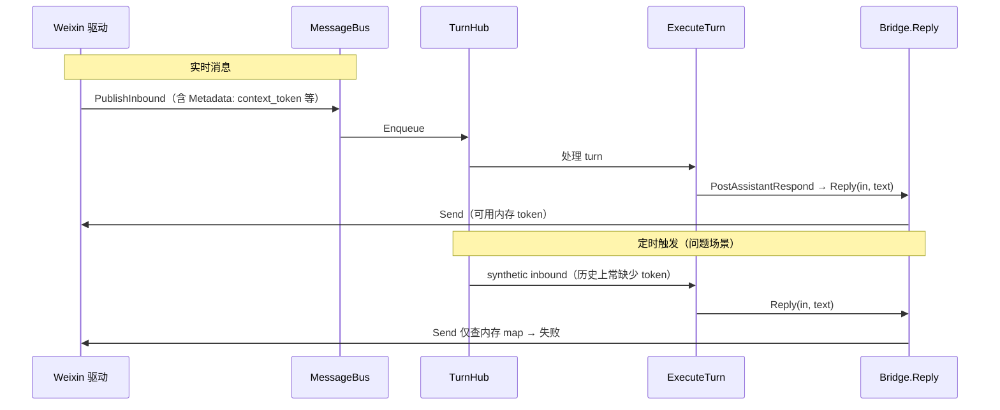

# 微信定时提醒无法主动下发：场景、原因与修复说明

本文记录 **Weixin（clawbridge）+ 定时任务（oneclaw schedule）** 联调中出现的一类问题：**定时触发后工作流执行失败或 Reply 无法送达客户端**，以及推荐的**分层修复方式**。便于后续维护 clawbridge 与 oneclaw 时对齐架构边界。

---

## 1. 遇到的问题（现象）

- 用户在 **微信** 会话里通过 Agent **创建定时/延时提醒**（cron 工具写入 `scheduled_jobs.json`）。
- 到达触发时间后，运行时确实拉起了一次「合成」的用户 turn（schedule poller → TurnHub → `runner.ExecuteTurn` → workflow → `on_respond` → **`Bridge.Reply`**）。
- 日志中出现类似错误：
  - `weixin: missing context token for chat <session_id>: clawbridge: send failed`
  - 或 clawbridge 出站日志里 **`Reply` 失败**，关联 **`schedule_job_id`**。

即：**调度逻辑跑了，但渠道侧发送被拒绝**，用户收不到提醒。

---

## 2. 场景描述

### 2.1 用户侧路径

1. 用户在微信里发消息，Agent 回复并调用 **cron** 添加「例如 1 分钟后提醒运动」。
2. 一分钟后（或 cron 到期），**没有对应的一条新的微信上行消息**，而是由 **schedule 模块**根据磁盘上的 job **构造一条 synthetic inbound**，再走与实时消息相同的 turn 管道。

### 2.2 技术路径（简化）

### 2.3 与实时消息的差异

| 维度 | 实时微信上行 | 定时任务触发 |
|------|----------------|----------------|
| `InboundMessage` 来源 | 驱动从 API 收到消息并发布 | `schedule.InboundFromJob` **合成** |
| `context_token` | 驱动写入 **Metadata**，并更新 **内存 map**（及可选持久化） | 若未快照进 job，则 **Metadata / 内存均无可靠 token** |
| `Bridge.Reply` | 通常能命中内存 token | 容易触发 **missing context token** |

---

## 3. 根因说明

Weixin **发送 API** 依赖 **`context_token`**（会话上下文凭证）。clawbridge 微信驱动历史上存在两条通路：

1. **内存（及磁盘恢复的）`contextTokens` map**：按 `from_user_id`/会话标识索引。
2. **入站消息的 `Metadata`**：例如 `context_token`、`from_user_id`，由驱动在收到真实消息时填入。

**问题**：`Reply` → `Send` 的路径若 **只依赖内存 map**，则在「**没有新鲜上行**、只有合成 inbound」时，map 中可能没有对应条目（或与你期望的会话键不一致），即使用户的 `SessionID`、客户端 ID 是对的，仍会报 **missing context token**。

这不是「schedule 写错了时间」类问题，而是 **异步触发场景下，回复所需的通道凭证没有进入本次 `Reply` 可用的上下文**。

---

## 4. 如何解决（推荐架构：两边各管一层）

### 4.1 clawbridge（通用、契约层）——主修复

**目标**：让 `Reply(ctx, in, text)` / `Send(msg)` 在「带齐 Metadata 的 inbound」场景下 **不依赖是否刚发生过真实上行**。

**推荐行为**：

1. **`Reply`**：在构造 outbound 后，若 **`in.Metadata["context_token"]`** 存在，则写入 **`OutboundMessage.Metadata`**（或与现有字段对齐），保证后续 `Send` 能看见。
2. **`Send`**：解析 `context_token` 时 **降级顺序**建议为：`内存 map` → **`msg.Metadata["context_token"]`** → 再报错。

这样，**任何调用方**只要能构造出携带约定 Metadata 的 `InboundMessage`（测试、重放、别的宿主），发送路径就与「实时消息」一致。

**边界**：clawbridge **不必**理解 cron、job JSON；只保证 **接口契约**：凭证可从 **本次 inbound / outbound 元数据** 读取。

### 4.2 oneclaw（宿主、异步边界）——配套修复

**目标**：定时任务跨时间边界，需在 **创建 job 时** 快照当前 turn 上渠道已提供的、且出站仍需要的键。

**推荐行为**：

1. 在 serve 路径把 **`InboundMessage.Metadata`**（或克隆）传入 `runner.ExecuteTurn`。
2. 使用 **白名单**（例如 `context_token`、`from_user_id`）写入 job 的 **`reply_meta`**（JSON：`reply_meta`）。
3. `InboundFromJob` 合成 inbound 时，将 **`reply_meta` 合并进 `Metadata`**（且不覆盖 `oneclaw.source`、`schedule.id`、`oneclaw.agent` 等已由合成逻辑占用的键）。

**边界**：不同渠道键名可能不同；白名单可按渠道演进，避免把整个 Metadata 落盘。

### 4.3 运维与迁移注意

- **已有旧 job**：若在实现 `reply_meta` **之前**创建，磁盘上没有 token，触发仍可能失败；需用户在 **有过正常微信上行** 的会话里 **删除并重新创建** 提醒。
- **进程重启**：依赖 clawbridge 自身是否持久化 context token；即使持久化，**与合成 inbound 的 session 键一致**仍应由 Metadata/`reply_meta` 兜底，减少隐性耦合。

---

## 5. 与本仓库实现的对应关系（便于代码对照）

| 层级 | 说明 |
|------|------|
| clawbridge | `third_party/clawbridge`（或上游仓库）中 **Weixin** `Send` / `Reply` 对 `Metadata` 的回退与拷贝；`go.mod` 中 **`replace`** 指向该副本直至上游合并发布。 |
| oneclaw | `schedule.Job.reply_meta`、`schedule.InboundFromJob`、`runner.Params.InboundMeta`、`subagent.TurnBinding.ReplyMeta`、cron 工具写入 job 等链路。 |

---

## 6. 一句话总结

- **现象**：定时触发走了 Reply，但微信缺少 **`context_token`**。  
- **场景**：合成 inbound **没有**带出与实时消息等价的 **Metadata**。  
- **解法**：**clawbridge** 统一「凭证可从 Metadata 获取」；**oneclaw** 在 **登记调度时快照 `reply_meta`**，触发时再 **灌回 synthetic inbound**。

两者叠加后，行为与架构边界清晰，且对其他「延迟 / 合成 inbound」场景可复用。
